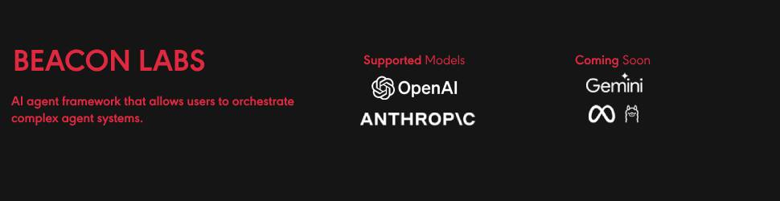

<br>
<br>
<a name="readme-top"></a>

<div align="center">


# What is Beacon Labs?
Beacon Labs offers a cutting-edge business ready framework where you can activate LLM calls, agents, and computer use to complete tasks cost-effectively. It provides more reliable systems, scalability, and a task-oriented structure that you need while completing real-world cases.

**Key features:**

- **Production-Ready Scalability**: Deploy seamlessly on AWS, GCP, or locally using Docker.
- **Task-Centric Design**: Focus on practical task execution, with options for:
    - Basic tasks via LLM calls.
    - Advanced tasks with V1 agents.
    - Complex automation using V2 agents with MCP integration.
- **MCP Server Support**: Utilize multi-client processing for high-performance tasks.
- **Tool-Calling Server**: Exception-secure tool management with robust server API interactions.
- **Computer Use Integration**: Execute human-like tasks using Anthropic’s ‘Computer Use’ capabilities.
- **Easily adding tools:** You can add your custom tools and MCP tools with a single line of code.
- **Client-server architecture**: Production-ready stateless enterprise-ready system

<br>
<br>

# 📙 Documentation

You can access our documentation at [https://the-beacon-labs.gitbook.io/the-beacon-labs](https://the-beacon-labs.gitbook.io/the-beacon-labs). All concepts, examples and explanations are available there.

<br>
<br>

# 🛠️ Getting Started

### Prerequisites

- Python 3.10 or higher
- Access to OpenAI or Anthropic API keys (Azure and Bedrock Supported)

## Installation

```bash
pip install beacon

```


# Basic Example

Set your OPENAI_API_KEY

```console
export OPENAI_API_KEY=sk-***
```

Start the agent 

```python
from beacon import Task, Agent

task = Task("Who developed you?")

agent = Agent("Coder")

agent.print_do(task)
```

<br>
<br>

## Features

### Direct LLM Call

LLMs have always been intelligent. We know exactly when to call an agent or an LLM. This creates a smooth transition from LLM to agent systems. The call method works like an agent, based on tasks and optimizing cost and latency for your requirements. Focus on the task. Don't waste time with complex architectures.

```python
from beacon import Direct

Direct.do(task1)

```


###  Response Format

The output is essential for deploying an AI agent across apps or as a service. At Beacon Labs, we use Pydantic BaseClass as input for the task system. This allows you to configure the output exactly how you want it, such as a list of news with title, body, and URL. You can create a flexible yet robust output mechanism that improves interoperability between the agent and your app.

```python
from beacon import ObjectResponse

# Example ObjectResponse usage
class News(ObjectResponse):
    title: str
    body: str
    url: str
    tags: list[str]

class ResponseFormat(ObjectResponse):
    news_list: list[News]

```


### Tool Integration

Our Framework officially supports [Model Context Protocol (MCP)](https://www.claudemcp.com/) and custom tools. You can use hundreds of MCP servers at https://glama.ai/mcp/servers or https://smithery.ai/ We also support Python functions inside a class as a tool. You can easily generate your integrations with that.
```python

from beacon.client.tools import Search

# MCP Tool
class HackerNewsMCP:
    command = "uvx"
    args = ["mcp-hn"]

# Custom Tool
class MyTools:
    def our_server_status():
        return True

tools = [Search, MyTools] # HackerNewsMCP

```


### Other LLM's

```python
agent = Agent("Coder", llm_model="openai/gpt-4o")
```
Access other LLMs through the [docs](https://the-beacon-labs.gitbook.io/the-beacon-labs)


### Memory

Humans have an incredible capacity for context length, which reflects their comprehensive context awareness and consistently produces superior results. At Beacon Labs, our memory system adeptly handles complex workflows, delivering highly personalized outcomes. It seamlessly remembers prior tasks and preferences, ensuring optimal performance. You can confidently set up memory settings within Agent, leveraging the agent_id system. Agents, each with their distinct personality, are uniquely identified by their ID, ensuring precise and efficient execution.

```python

agent_id_ = "product_manager_agent"

agent = Agent(
    agent_id_=agent_id_
    ...
    memory=True
)
```

### Knowledge Base

The Knowledge Base provides private or public content to your agent to ensure accurate and context-aware tasks. For example, you can provide a PDF and URL to the agent. The Knowledge Base seamlessly integrates with the Task System, requiring these sources. 

```python
from beacon import KnowledgeBase

my_knowledge_base = KnowledgeBase(files=["sample.pdf", "https://TheBeaconLabs.com"])

task1 = Task(
    ...
    context[my_knowledge_base]
)

```

### Connecting Task Outputs

Chaining tasks is essential for complex workflows where one task's output informs the next. You can assign a task to another as context for performing the job. This will prepare the response of task 1 for task 2.

```python

task1 = Task(
    ...
)

task2 = Task(
    ...
    context[task1]
)

```

### Be a Human

Agent and characterization are based on LLM itself. We are trying to characterize the developer, PM, and marketing. Sometimes, we need to give a human name. This is required for tasks like sending personalized messages or outreach. For these requirements, we have name and contact settings in Agent. The agent will feel like a human as you specify.

```python
product_manager_agent = Agent(
    ...
    name="John Walk"
    contact="john@beacon.ai"
)

```

### Multi Agent

Distribute tasks effectively across agents with our automated task distribution mechanism. This tool matches tasks based on the relationship between agent and task, ensuring collaborative problem-solving across agents and tasks. 
```python
from beacon import MultiAgent

MultiAgent.do([agent2, agent1], [task1, task2])
```

### Reliable Computer Use
Computer use can able to human task like humans, mouse move, mouse click, typing and scrolling and etc. So you can build tasks over non-API systems. It can help your linkedin cases, internal tools. Computer use is supported by only Claude for now.

```python

from beacon.client.tools import ComputerUse

...

tools = [ComputerUse]
...

```

### Reflection
LLM's by their nature oriented to finish your process. By the way its mean sometimes you can get empty result. Its effect your business logic and your application progress. We support reflection mechanism for that to check the result is staisfying and if not give a feedback. So you can use the reflection for preventing blank messages and other things.

```python
product_manager_agent = Agent(
    ...
    reflection=True
)

```


### Compress Context
The context windows can be small as in OpenAI models. In this kind of situations we have a mechanism that compresses the message, system_message and the contexts. If you are working with situations like deepsearching or writing a long content and giving it as context of another task. The compress_context is full fit with you. This mechanism will only work in context overflow situations otherwise everything is just normal.

```python
product_manager_agent = Agent(
    ...
    compress_context=True
)

```

<br>
<br>

### Telemetry

We use anonymous telemetry to collect usage data. We do this to focus our developments on more accurate points. You can disable it by setting the BEACON_TELEMETRY environment variable to false.

```python
import os
os.environ["BEACON_TELEMETRY"] = "False"
```
<br>
<br>


### Coming Soon

- **Dockerized Server Deploy**
- **Verifiers For Computer Use**
